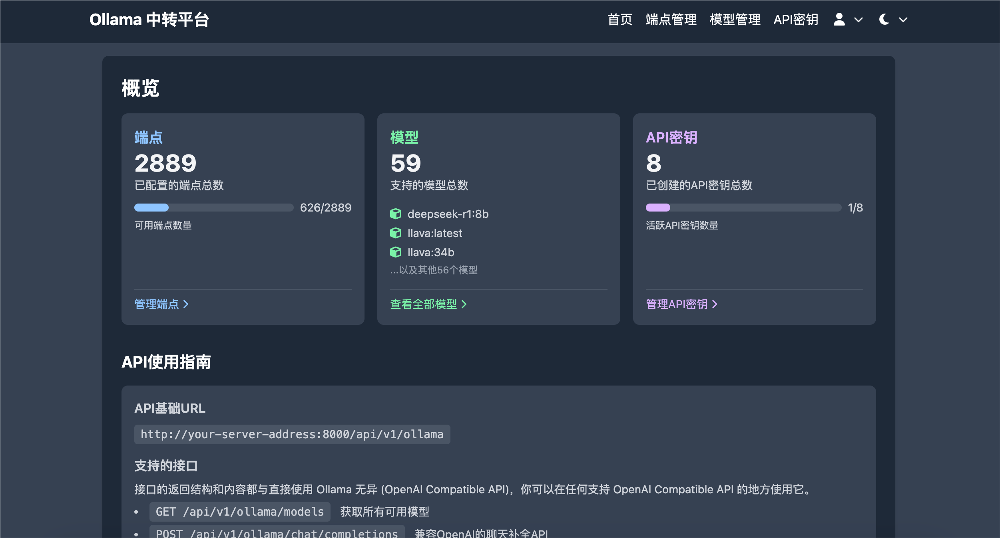
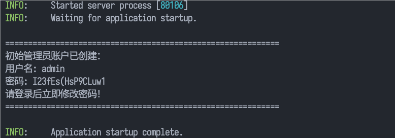
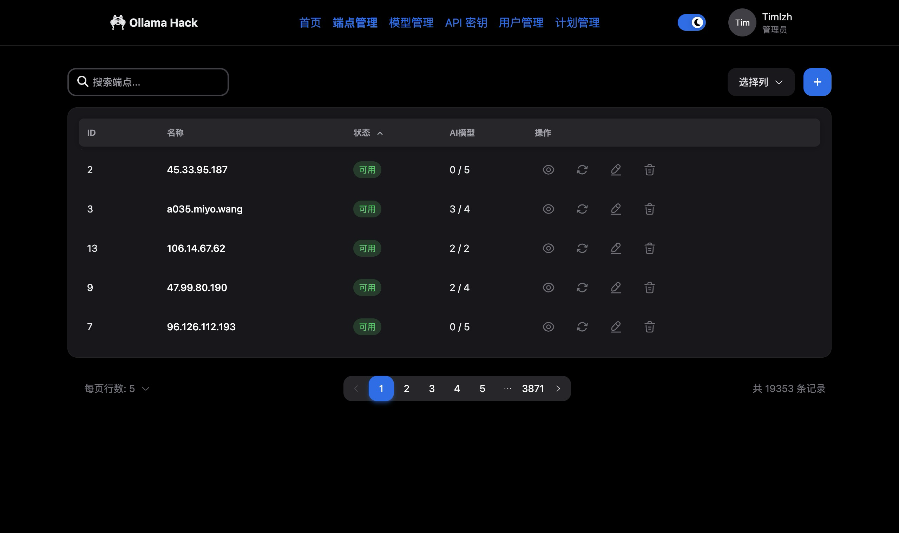
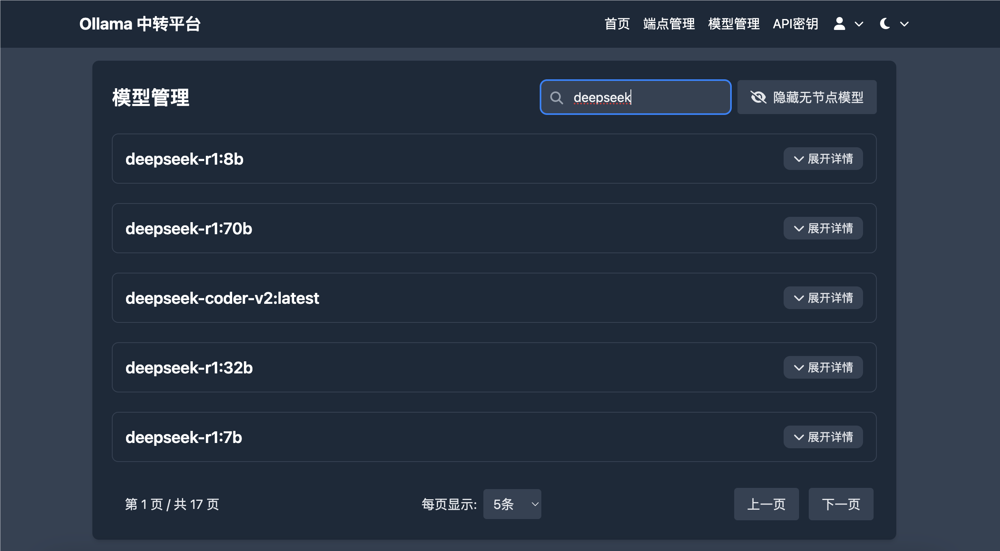
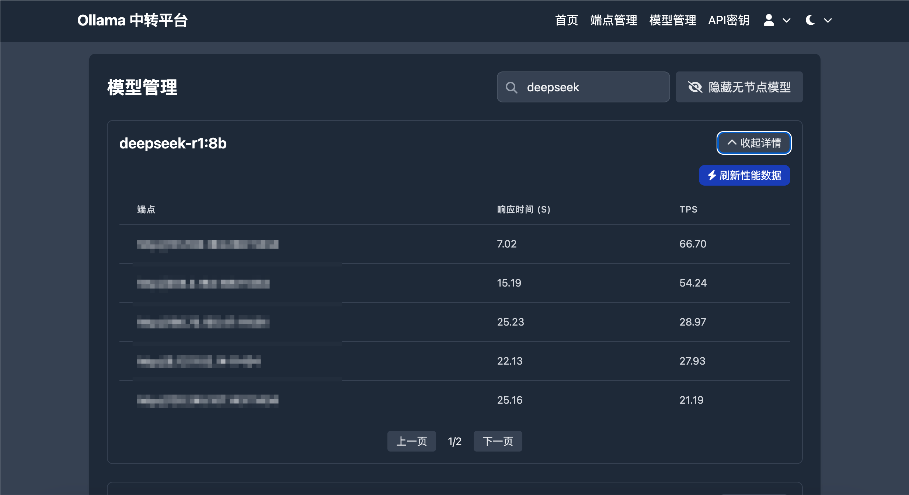
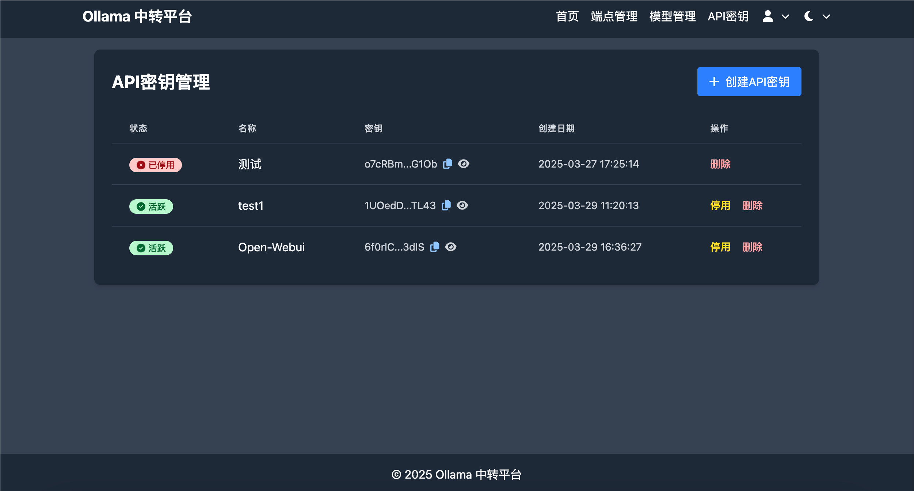
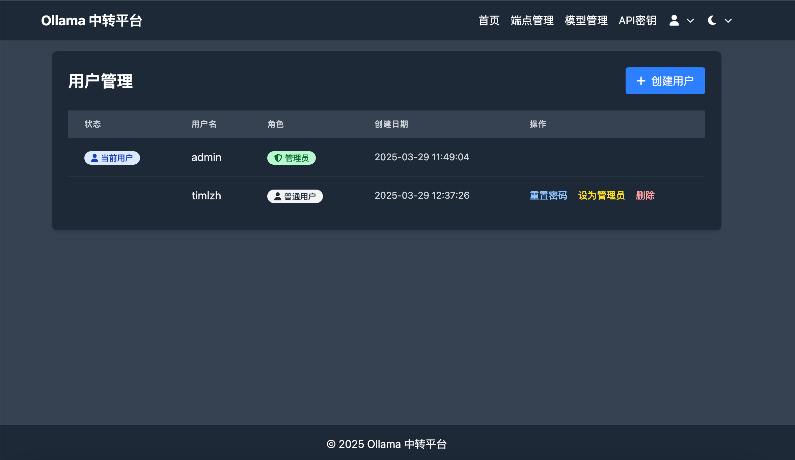

# Ollama-Hack 🚀

[English](README.EN.md) | [简体中文](README.md)



## 📖 Introduction

> Numerous unauthenticated Ollama interfaces are exposed online, and you want to use them, but it's too troublesome to test performance and check models one by one? And you might need to frequently replace invalid endpoints?
>
> Try Ollama-Hack! It's a Python-based proxy platform that helps you easily manage, test, and seamlessly use multiple Ollama interfaces.

A service for managing, testing, and forwarding Ollama APIs. It can centrally manage multiple Ollama endpoints and automatically select the optimal route (highest Token/s) for use, providing an OpenAI-compatible API. The platform offers a user-friendly web interface for managing endpoints, models, and API keys.

## ✨ Features

-   🔄 **Multi-endpoint Management**: Centrally manage multiple Ollama service endpoints, with batch import capability
-   🧩 **OpenAI API Compatibility**: Provides OpenAI-compatible API interfaces
-   ⚖️ **Optimal Route Selection**: Automatically selects the optimal Ollama endpoint based on Token/s performance
-   🔑 **API Key Management**: Generate and manage API keys for authentication
-   📊 **Performance Monitoring**: Test and display performance metrics for models across different endpoints
-   🔍 **Model Query**: Search and filter available models
-   🔐 **User Management**: Administrators can create and manage user accounts
-   🌙 **Dark Mode**: Supports light/dark theme switching

## 🛠️ Requirements

-   Python 3.12+ or Docker

## 🚀 Installation and Running

### Method 1: Deploy with Docker (Recommended)

If you have Docker and Docker Compose installed, you can start with these commands:

```bash
git clone https://github.com/timlzh/Ollama-Hack.git
cd Ollama-Hack
# Build and start containers
docker-compose up -d

# View logs (includes initial admin account information)
docker-compose logs -f
```

Open http://localhost:8000 to use.

### Method 2: Direct Run

```bash
git clone https://github.com/timlzh/Ollama-Hack.git
cd Ollama-Hack
pip install -r requirements.txt
uvicorn main:app --host 0.0.0.0 --port 8000
```

## 📝 Usage

### Web Interface

Visit http://localhost:8000 to use the web interface. For security, an admin account with a random password is generated at first startup. You can find this password in the logs:



After logging in, you can create new user accounts, manage API keys and endpoints.

### API Usage Example

```bash
curl -N -X POST http://your-server-address:8000/api/v1/ollama/chat/completions \
  -H "Content-Type: application/json" \
  -H "Authorization: Bearer YOUR_API_KEY" \
  -d '{
    "model": "llama3",
    "messages": [
      {"role": "system", "content": "You are a helpful assistant"},
      {"role": "user", "content": "Hello, please introduce yourself"}
    ],
    "temperature": 0.7,
    "stream": true
  }'
```

Main supported API endpoints:

-   `GET /api/v1/ollama/models` - Get all available models
-   `POST /api/v1/ollama/chat/completions` - OpenAI-compatible chat completion API

## 👤 Author

[Timlzh](https://github.com/timlzh)

## 📜 License

MIT License

## 🖼️ Screenshots

-   Home
    
-   Endpoint Management
    
-   Model Management
    
-   Model Performance
    
-   API Key Management
    
-   User Management
    
