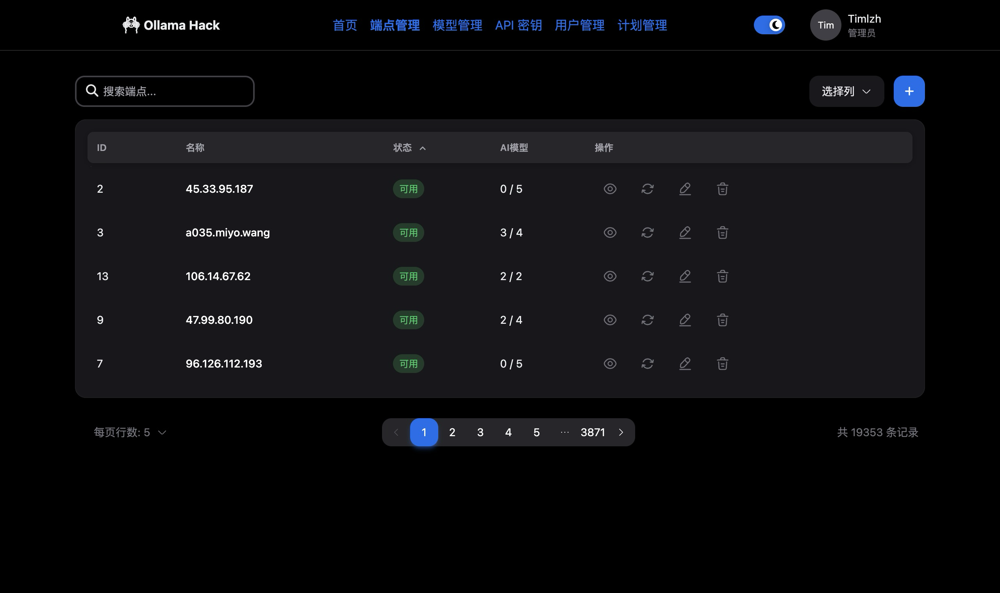
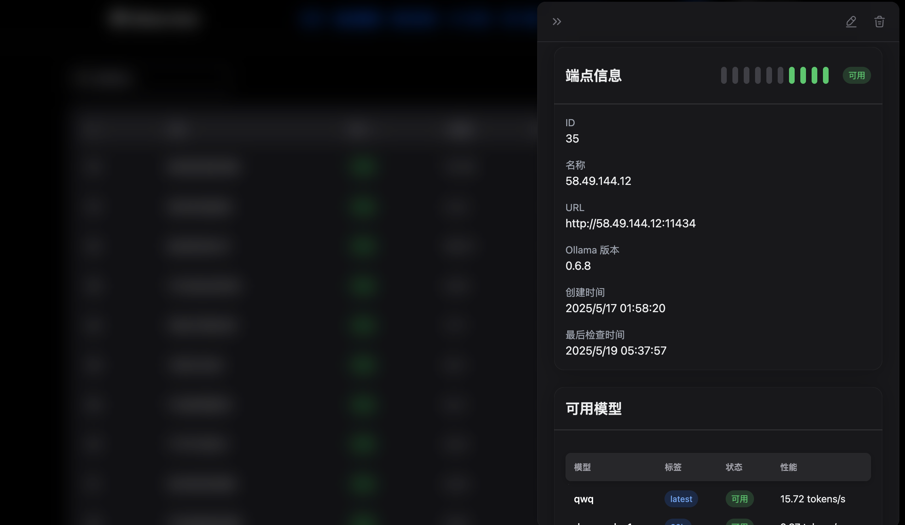
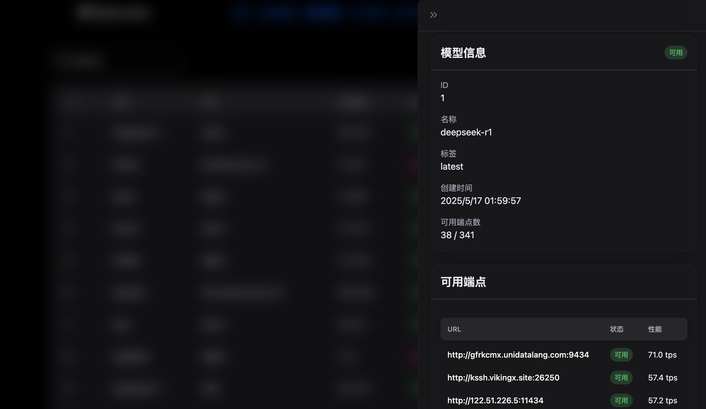

# Ollama-Hack V2 🚀

## 📖 简介

> 网上许多暴露无鉴权的 Ollama 接口，想薅来使用，但是一个一个试性能、查模型太麻烦了？还可能要频繁更换失效的接口？
>
> 来试试 Ollama-Hack 吧！它是一个基于 Python 的中转平台，能够帮助你轻松管理、测试和无缝使用多个 Ollama 接口。

Ollama-Hack 是一个用于管理、测试和转发 Ollama API 的服务。它可以集中管理多个 Ollama 端点，并根据性能自动选择最优的线路，提供兼容 OpenAI 的 API。平台提供友好的 Web 界面，方便用户管理端点、模型、API 密钥和用量计划。

## ✨ 功能特性

-   🔄 **多端点管理**：集中管理多个 Ollama 服务端点，可以批量进行导入
    
-   🔍 **端点详情**：查看每个端点的详细信息和可用模型
    
-   🧩 **兼容 OpenAI API**：提供兼容 OpenAI 的 API 接口
-   ⚖️ **最优线路选择**：根据 Token/s 性能自动选择最优的 Ollama 端点
-   🔑 **API 密钥管理**：生成和管理用于身份验证的 API 密钥
-   📊 **性能监控**：测试和显示不同端点上模型的性能指标
-   📝 **模型管理**：搜索和查看可用的模型
    
-   📈 **模型性能**：查看每个模型的详细性能数据
    
-   🔐 **用户管理**：管理员可以创建和管理用户账户
-   💰 **计划管理**：创建和管理不同的用量计划，限制 API 请求频率
-   🌙 **深色模式**：支持明亮/暗黑主题切换

## 🛠️ 环境要求

-   Docker 和 Docker Compose（推荐）
-   或 Python 3.12+（直接运行）

## 🚀 安装与运行

### 方法一：使用 Docker 部署（推荐）

如果你已安装 Docker 和 Docker Compose，可以使用以下命令一键启动：

```bash
# 下载 docker-compose.yml 文件
curl -o docker-compose.yml https://raw.githubusercontent.com/timlzh/ollama-hack/main/docker-compose.example.yml

# 修改 docker-compose.yml 文件中的密钥等敏感配置
vim docker-compose.yml

# 启动服务
docker compose up -d
```

服务启动后，打开 http://localhost:3000/init 即可使用。

### 方法二：直接运行（开发环境）

#### 后端

```bash
cd backend
# 使用Poetry安装依赖
pip install poetry
poetry install

# 启动服务
poetry run uvicorn src.main:app --host 0.0.0.0 --port 8000
```

#### 前端

```bash
cd frontend
# 安装依赖
yarn install

# 开发模式启动
yarn dev
```

## 📝 使用方法

### Web 界面

访问 http://localhost:3000/init 来初始化管理员账户。

登录后，你可以：

-   创建和管理用户账户
-   添加和管理 Ollama 端点
-   生成 API 密钥
-   创建和分配用量计划
-   查看模型性能数据

### 计划管理

V2 版本新增了计划管理功能，管理员可以创建不同的用量计划，并将其分配给用户。每个计划可以设置：

-   每分钟请求限制 (RPM)
-   每天请求限制 (RPD)
-   默认计划标记

### API 使用示例

#### 兼容 Ollama API

```bash
curl -N -X POST http://localhost:3000/v1/chat/completions \
  -H "Content-Type: application/json" \
  -H "Authorization: Bearer YOUR_API_KEY" \
  -d '{
    "model": "llama3",
    "messages": [
      {"role": "system", "content": "你是一个有帮助的助手"},
      {"role": "user", "content": "你好，请介绍一下自己"}
    ],
    "temperature": 0.7,
    "stream": true
  }'
```

Ollama-Hack 支持 Ollama 的全部 OpenAI 兼容 API，详细列表请参考：[Ollama/OpenAI Compability](https://github.com/ollama/ollama/blob/main/docs/openai.md)。

## 🔧 配置选项

### 环境变量

在 docker-compose.yml 文件中，你可以通过以下环境变量自定义后端：

```yaml
environment:
    - APP__ENV=prod # 环境类型：dev 或 prod
    - APP__LOG_LEVEL=INFO # 日志级别
    - APP__SECRET_KEY=change_this_key # JWT密钥
    - APP__ACCESS_TOKEN_EXPIRE_MINUTES=30 # 访问令牌过期时间
    - DATABASE__ENGINE=mysql # 数据库引擎
    - DATABASE__HOST=db # 数据库主机
    - DATABASE__USERNAME=user # 数据库用户名
    - DATABASE__PASSWORD=password # 数据库密码
    - DATABASE__DB=ollama_hack # 数据库名称
```

## 👤 作者

[Timlzh](https://github.com/timlzh)

## 📜 许可证

MIT License

## 🖼️ 截图

-   主页
    
-   端点管理
    
-   模型管理
    
-   模型详情
    
-   端点详情
    
