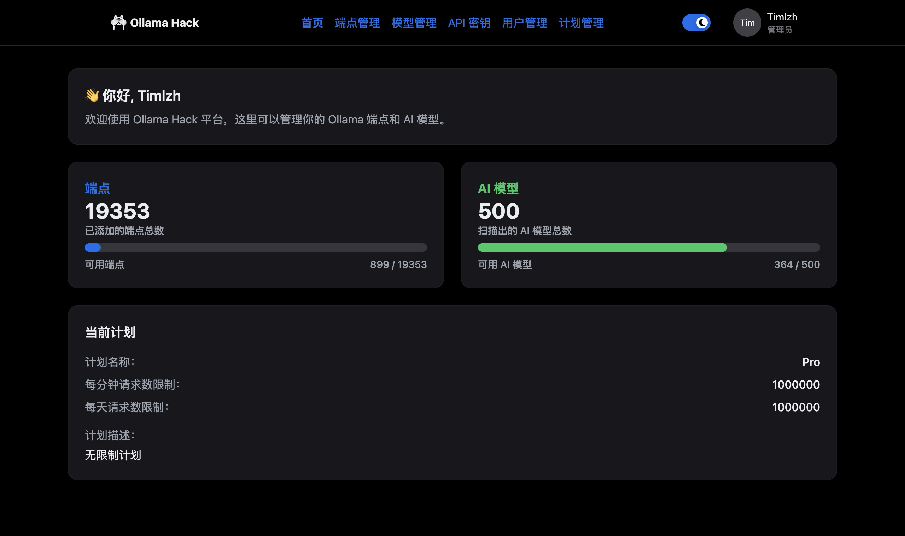
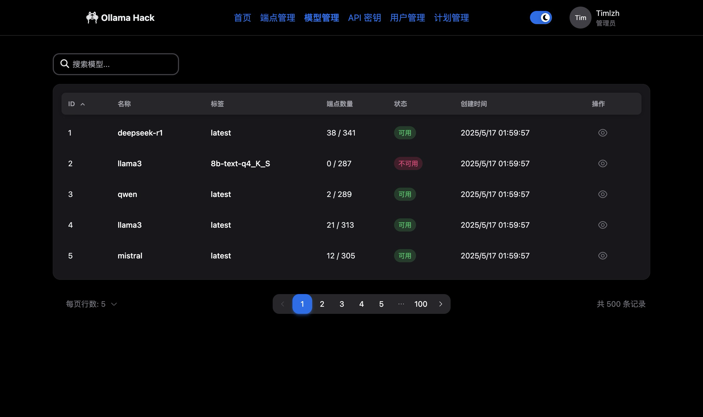

# Ollama-Hack 🚀

[English](README.EN.md) | [简体中文](README.md)



## 📖 简介

> 网上许多暴露无鉴权的 Ollama 接口，想薅来使用，但是一个一个试性能、查模型太麻烦了？还可能要频繁更换失效的接口？
>
> 来试试 Ollama-Hack 吧！它是一个基于 Python 的中转平台，能够帮助你轻松管理、测试和无缝使用多个 Ollama 接口。

一个用于管理、测试和转发 Ollama API 的服务。它可以集中管理多个 Ollama 端点，并自动选择最优的线路 (Token/s 最高) 进行使用，提供兼容 OpenAI 的 API。平台提供友好的 Web 界面，方便用户管理端点、模型和 API 密钥。

## ✨ 功能特性

-   🔄 **多端点管理**：集中管理多个 Ollama 服务端点，可以批量进行导入
-   🧩 **兼容 OpenAI API**：提供兼容 OpenAI 的 API 接口
-   ⚖️ **最优线路选择**：根据 Token/s 性能自动选择最优的 Ollama 端点
-   🔑 **API 密钥管理**：生成和管理用于身份验证的 API 密钥
-   📊 **性能监控**：测试和显示不同端点上模型的性能指标
-   🔍 **模型查询**：搜索和过滤可用的模型
-   🔐 **用户管理**：管理员可以创建和管理用户账户
-   🌙 **深色模式**：支持明亮/暗黑主题切换

## 🛠️ 环境要求

-   Python 3.12+ 或 Docker

## 🚀 安装与运行

### 方法一：使用 Docker 部署（推荐）

如果你已安装 Docker 和 Docker Compose，可以使用以下命令一键启动：

```bash
git clone https://github.com/timlzh/Ollama-Hack.git
cd Ollama-Hack
# 构建并启动容器
docker-compose up -d

# 查看日志（包含初始管理员账户信息）
docker-compose logs -f
```

打开 http://localhost:8000 即可使用。

### 方法二：直接运行

```bash
git clone https://github.com/timlzh/Ollama-Hack.git
cd Ollama-Hack
pip install -r requirements.txt
uvicorn main:app --host 0.0.0.0 --port 8000
```

## 📝 使用方法

### Web 界面

访问 http://localhost:8000 来使用 Web 界面。为了应用安全，首次启动时会生成一个随机密码的管理员账户。你可以在日志中找到这个密码：


登录后，你可以创建新的用户账户，管理 API 密钥和端点。

### API 使用示例

```bash
curl -N -X POST http://your-server-address:8000/api/v1/ollama/chat/completions \
  -H "Content-Type: application/json" \
  -H "Authorization: Bearer YOUR_API_KEY" \
  -d '{
    "model": "llama3",
    "messages": [
      {"role": "system", "content": "你是一个有帮助的助手"},
      {"role": "user", "content": "你好，请介绍一下自己"}
    ],
    "temperature": 0.7,
    "stream": true
  }'
```

理论上支持 Ollama 支持的所有 OpenAI Compatible API，具体列表见：[Ollama/OpenAI Compability](https://github.com/ollama/ollama/blob/main/docs/openai.md)，接口的返回结构和内容都与直接使用 Ollama 无异。

## 👤 作者

[Timlzh](https://github.com/timlzh)

## 📜 许可证

MIT License

## 🖼️ 截图

-   主页
    
-   端点管理
    
-   模型管理
    
-   模型性能
    
-   API 密钥管理
    
-   用户管理
    
